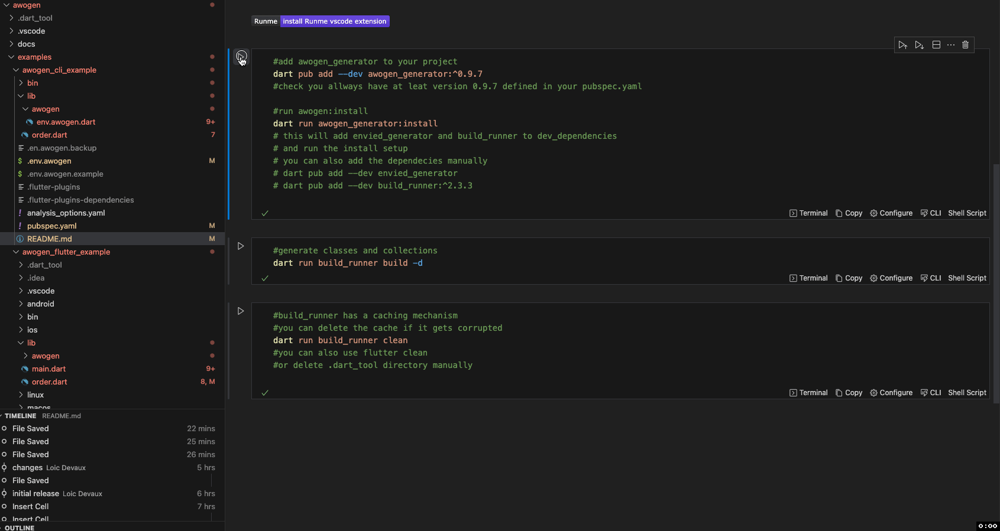
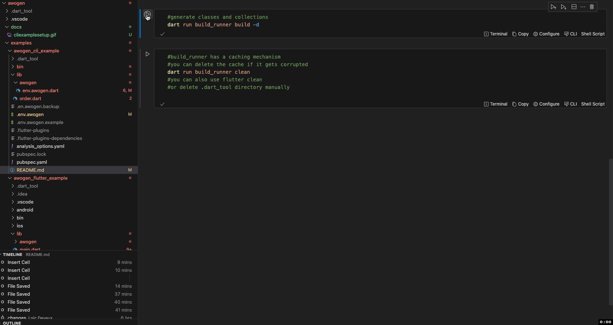
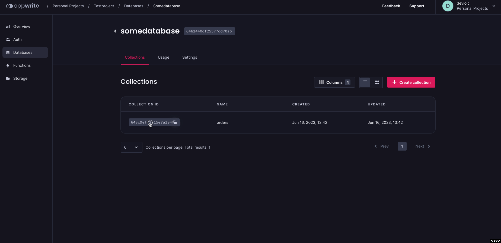

# awogen_cli_example

an example project targeting CLI (no flutter) with awogen

## Getting started

- change configuration parameters in .env.awogen

| Key   |  description |
|----------|:------|
| PROJECTID=23214df25c5d141cd11e |create the id in your appwrite console |
| DATABASEID=3847980df24672dd26a4 |create the id your appwrite console |
| ENDPOINT=https://cloud.appwrite.io/v1 | appwrite cloud or selfhosted endpoint url |
| FLAVOR=dev | just a tag so you can check inside the code if it targets dev,prod,staging or so |
| APIKEY=37a801ee43ed75699159b... | create it in your appwrite console, needed for awogen to be able to create collections and attributes in your appwrite project |
| APPWRITE_USE_CLIENTSDK=false | set it to true if you want to include  appwrite flutter sdk |
| APPWRITE_USE_SERVERSDK=true | set it to true if you want to include appwrite server sdk |
| PPWRITE_OBFUSCATE=true | PROJECTID, DATABASEID, ENDPOINT, APIKEY will be obfuscated in dart classes (uses envied) |

Run commands below with [runme](https://runme.dev/) directly in this README.MD with vscode

[](vscode:extension/stateful.runme)

```sh
#add awogen_generator to your project
dart pub add --dev awogen_generator:^0.9.7
#check you allways have at leat version 0.9.7 defined in your pubspec.yaml

#run awogen:install
dart run awogen_generator:install
# this will add envied_generator and build_runner to dev_dependencies
# and run the install setup
# you can also add the dependecies manually
# dart pub add --dev envied_generator
# dart pub add --dev build_runner:^2.3.3

```

  

define your appwrite mapped classes

Example: order.dart  

```dart
// ignore_for_file: unused_element
import 'awogen/env.awogen.dart';
import "package:awogen/AwIncludes.dart";

part 'order.g.dart';

enum myenum { red, green, yellow }

@awogen(["myexcludedfield", "myexcludedfield2"])
class _Order {
  String? name = "somename";
  bool? myboolean;
  DateTime? mydatetime;
  double? amount;
  int? myint;
  static const List<String> blabla = ["gogo", "gaga", "gugu"];
  AwEmail? email;
  AwUrl? url;
  AwIp? ip;
  String? myexcludedfield;
  String? myexcludedfield2;
  _Order();
}
```

```sh { background=false }
#generate classes and collections
dart run build_runner build -d
```

  

resulting class: order.g.dart

```dart
// GENERATED CODE - DO NOT MODIFY BY HAND

part of 'order.dart';

// **************************************************************************
// AwGenerator
// **************************************************************************

enum blabla_awEnum { gogo, gaga, gugu }

class Order extends AwObject {
  @override
  String get collectionId => "648c8bba5a9fd6ccef76";
  @override
  AwServerHelper? get awServerHelper => null;

  @override
  AwClientHelper? get awClientHelper => AwClientHelper(
      config: AwogenEnv(
          PROJECTID: Env.PROJECTID,
          DATABASEID: Env.DATABASEID,
          ENDPOINT: Env.ENDPOINT));

  static Map<String, List<String>> enum_values = {
    "blabla_awEnum": ["gogo", "gaga", "gugu"],
  };
  @override
  Map<String, List<String>> get enum_values2 => enum_values;

  String? name;
  bool? myboolean;
  DateTime? mydatetime;
  double? amount;
  int? myint;
  blabla_awEnum? blabla;
  AwEmail? email;
  AwUrl? url;
  AwIp? ip;
  String? myexcludedfield;
  String? myexcludedfield2;
  String? getblablaValue() {
    if (blabla != null) {
      return enum_values2["blabla_awEnum"]![blabla!.index];
    }
    return null;
  }

  Order({
    this.name,
    this.myboolean,
    this.mydatetime,
    this.amount,
    this.myint,
    this.blabla,
    this.email,
    this.url,
    this.ip,
    this.myexcludedfield,
    this.myexcludedfield2,
    collectionId,
    documentId,
  });
  Map<String, dynamic> toMap() {
    return {
      'name': name,
      'myboolean': myboolean,
      'mydatetime': mydatetime,
      'amount': amount,
      'myint': myint,
      'blabla': blabla,
      'email': email,
      'url': url,
      'ip': ip,
      'myexcludedfield': myexcludedfield,
      'myexcludedfield2': myexcludedfield2,
      'collectionId': collectionId,
      'documentId': documentId,
    };
  }

  @override
  Map<String, dynamic> toJSON() {
    return {
      'collectionId': collectionId,
      'documentId': documentId,
      'name': name,
      'myboolean': myboolean,
      'mydatetime': mydatetime?.toUtc().toIso8601String(),
      'amount': amount,
      'myint': myint,
      'blabla': blabla != null ? blabla!.index : null,
      'email': email?.email,
      'url': url?.url,
      'ip': ip?.ip,
    };
  }

  factory Order.fromMap(Map<String, dynamic> map) {
    return Order(
      name: map['name'],
      myboolean: map['myboolean'],
      mydatetime: map['mydatetime'].runtimeType == DateTime
          ? map['mydatetime']
          : map['mydatetime'] != null
              ? DateTime.parse(map['mydatetime'])
              : null,
      amount: map['amount'].runtimeType == double
          ? map['amount']
          : map['amount'] != null
              ? map['amount'].toDouble()
              : null,
      myint: map['myint'],
      blabla: blabla_awEnum
          .values[enum_values["blabla_awEnum"]!.indexOf(map['blabla'])],
      email: map['email'].runtimeType == AwEmail
          ? map['email']
          : map['email'] != null
              ? AwEmail(map['email'])
              : null,
      url: map['url'].runtimeType == AwUrl
          ? map['url']
          : map['url'] != null
              ? AwUrl(map['url'])
              : null,
      ip: map['ip'].runtimeType == AwIp
          ? map['ip']
          : map['ip'] != null
              ? AwIp(map['ip'])
              : null,
      myexcludedfield: map['myexcludedfield'],
      myexcludedfield2: map['myexcludedfield2'],
      collectionId: map['collectionId'],
      documentId: map['documentId'],
    );
  }
  Order copyWith({
    String? name,
    bool? myboolean,
    DateTime? mydatetime,
    double? amount,
    int? myint,
    blabla_awEnum? blabla,
    AwEmail? email,
    AwUrl? url,
    AwIp? ip,
    String? myexcludedfield,
    String? myexcludedfield2,
    String? collectionId,
    String? documentId,
  }) {
    return Order(
      name: name ?? this.name,
      myboolean: myboolean ?? this.myboolean,
      mydatetime: mydatetime ?? this.mydatetime,
      amount: amount ?? this.amount,
      myint: myint ?? this.myint,
      blabla: blabla ?? this.blabla,
      email: email ?? this.email,
      url: url ?? this.url,
      ip: ip ?? this.ip,
      myexcludedfield: myexcludedfield ?? this.myexcludedfield,
      myexcludedfield2: myexcludedfield2 ?? this.myexcludedfield2,
      collectionId: collectionId ?? this.collectionId,
      documentId: documentId ?? this.documentId,
    );
  }

  @override
  AwObject toObject(dynamic doc) {
    Order result = Order.fromMap(doc.data);
    result.documentId = doc.$id;
    return result;
  }
}
```

```sh { background=false interactive=true }
#build_runner has a caching mechanism
#you can delete the cache if it gets corrupted
dart run build_runner clean
#you can also use flutter clean
#or delete .dart_tool directory manually

```

generated collection:  
  


  

awogen_generator uses envied_generator to make .env.awogen keys and values accessible at runtime through the Env class in   
awogen/env.awogen.dart  

```dart
@Envied(path: ".env.awogen")
    abstract class Env {
    @EnviedField(varName: 'PROJECTID', obfuscate: true)  
    static final String PROJECTID = _Env.PROJECTID;  
    @EnviedField(varName: 'DATABASEID', obfuscate: true)  
    static final String DATABASEID = _Env.DATABASEID;
    @EnviedField(varName: 'ENDPOINT', obfuscate: true)
    static final String ENDPOINT = _Env.ENDPOINT;
    @EnviedField(varName: 'FLAVOR', obfuscate: false)
    static final String FLAVOR = _Env.FLAVOR;
    @EnviedField(varName: 'APIKEY', obfuscate: true)
    static final String APIKEY = _Env.APIKEY ;
}
```

envied_generator can offer some obfuscation of those values according to the obfuscate parameter inside the class and the parameter  
in env.awogen APPWRITE_OBFUSCATE